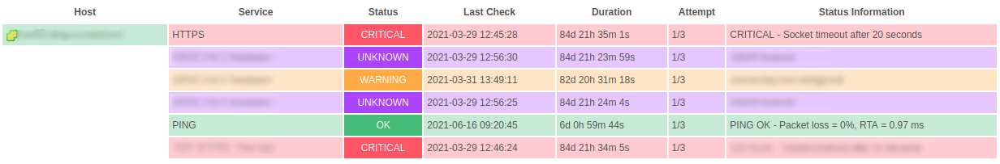

# Icingaweb2 Treeview

This module tries to recreate the old Icinga Service Statusdetail view.
It displays hosts and services in a tree like structure.

# Documentation
 
 * [Installation](doc/INSTALL.md)
